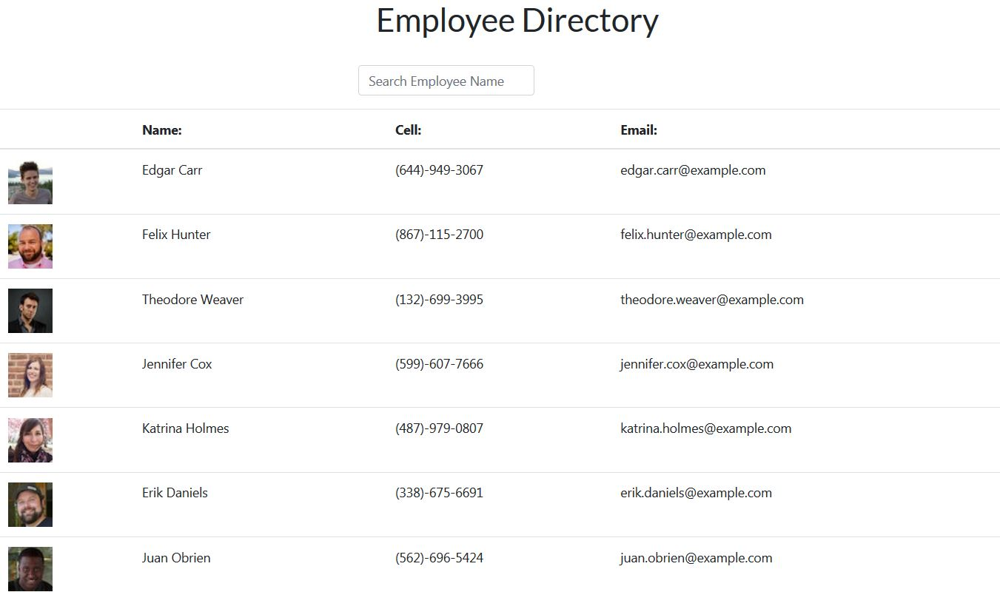

# Employee-Directory

## Description

The Employee Directory is a simple app that allows you to search for Employees in the  companies directory by first name.       

## Technologies
The Employee Directory was created by utilizing React to populate the page and search for employees via an API call and Javascript along with the functionality that React provides from its library. 

## Usage

Simply input the name of the Employee in the seacrh box at the top of the page and the name will be filtered to only show that individual or individuals.  The name in the search box must have the first letter capitalized.  

## Budget-Tracker GitHub Link
https://guillenjoshua.github.io/Employee-Directory/

## Author
Joshua Guillen

### GitHub Profile: 
https://github.com/guillenjoshua

### Email Contact: 
guillenjoshua@gmail.com

## IMG

